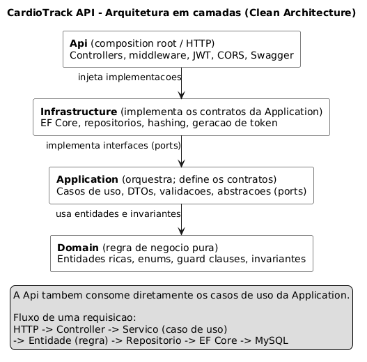

# CardioTrack API

API REST de **acompanhamento de saude cardiaca**. Permite que um usuario crie uma
conta, autentique-se, registre medicoes (pressao arterial, frequencia cardiaca,
oxigenacao do sangue, peso corporal e sintomas) e consulte relatorios o
historico das medicoes e um resumo agregado pronto para alimentar graficos no
front-end.


## Sumario

- [Tecnologias](#tecnologias)
- [Arquitetura](#arquitetura)
- [Estrutura de pastas](#estrutura-de-pastas)
- [Como executar](#como-executar)
- [Configuracao](#configuracao)
- [Endpoints](#endpoints)
- [Autenticacao](#autenticacao)
- [Tratamento de erros](#tratamento-de-erros)
- [Testes](#testes)
- [Documentacao da API](#documentacao-da-api)

## Tecnologias

- **.NET 9** (ASP.NET Core Web API)
- **Entity Framework Core 9** com provider **MySQL** (Pomelo)
- **MySQL 8** (executado via Docker durante o desenvolvimento)
- **JWT** para autenticacao (Bearer)
- **FluentValidation** para validacao de entrada
- **Swagger / OpenAPI** para documentacao
- **xUnit** para testes; **Testcontainers** para os testes de integracao

## Arquitetura

O projeto segue uma arquitetura em camadas (Clean Architecture) com domain
model rico. Cada camada vive em um projeto separado da solution, o que torna a
modularizacao explicita no proprio grafo de dependencias e facilita testar cada
camada de forma isolada.

### Regra de dependencia

As dependencias apontam sempre para dentro: nenhuma camada interna conhece as
externas. O `Domain` nao referencia nada; a `Application` depende so do `Domain`;
a `Infrastructure` e a `Api` ficam na borda. Como a `Infrastructure` implementa
contratos (interfaces) declarados na `Application`, a dependencia de detalhes
(EF Core, JWT, MySQL) e invertida — a regra de negocio nao sabe qual banco ou
qual algoritmo de hash existe por tras (Dependency Inversion).



> Diagrama gerado a partir de [`docs/arquitetura.puml`](docs/arquitetura.puml).

### Camadas (projetos)

| Projeto | Responsabilidade | Depende de |
|---------|------------------|------------|
| `CardioTrack.Domain` | Entidades ricas (`Usuario`, `Medicao`), enums (`Sexo`, `Sintoma`) e invariantes de negocio. Sem dependencia de frameworks. | — |
| `CardioTrack.Application` | Casos de uso (servicos), DTOs de entrada/saida, validadores (FluentValidation) e **contratos** (`IRepositorio*`, `IUnidadeDeTrabalho`, `IGeradorDeToken`, `IServicoDeHashDeSenha`). | Domain |
| `CardioTrack.Infrastructure` | Implementacoes dos contratos: `DbContext`, mapeamentos e repositorios EF Core, migrations, `UnidadeDeTrabalho`, geracao de JWT e hashing de senha. | Application |
| `CardioTrack.Api` | Composition root: controllers, middleware de erros, e configuracao de Swagger, JWT e CORS. | Application, Infrastructure |
| `CardioTrack.Tests.Unit` | Testes das regras de dominio, servicos e validadores (sem Docker). | — |
| `CardioTrack.Tests.Integration` | Testes dos endpoints contra um MySQL real (Testcontainers). | — |

### Modularizacao

A modularizacao acontece em **dois eixos complementares**:

1. **Horizontal (por camada).** A separacao tecnica acima isola responsabilidades
   e permite trocar detalhes de infraestrutura sem tocar na regra de negocio.

2. **Vertical (por funcionalidade).** Dentro de cada camada o codigo e agrupado
   por dominio — **Usuarios**, **Medicoes** e **Relatorios** — em vez de por tipo
   tecnico. Cada funcionalidade reune seus proprios DTOs, validacoes e servicos,
   formando uma fatia vertical coesa que atravessa as camadas:

   ```
   Application/
   ├── Abstracoes/        # contratos (ports) consumidos pelos servicos
   │   ├── Persistencia/  #   IRepositorioUsuario, IRepositorioMedicao, IUnidadeDeTrabalho
   │   └── Seguranca/     #   IGeradorDeToken, IServicoDeHashDeSenha
   ├── Comum/             # excecoes de aplicacao e extensoes de validacao
   ├── Usuarios/          # fatia vertical "Usuarios"
   │   ├── Dtos/          #   contratos de entrada/saida do caso de uso
   │   ├── Validacoes/    #   validadores FluentValidation
   │   └── Servicos/      #   caso de uso (IServicoUsuario / ServicoUsuario)
   ├── Medicoes/          # mesma estrutura: Dtos / Validacoes / Servicos
   └── Relatorios/        # mesma estrutura: Dtos / Servicos
   ```

   Esse layout deixa cada funcionalidade autocontida (alta coesao, baixo
   acoplamento) e facilita localizar e evoluir tudo que pertence a um dominio.

### Padroes e decisoes de design

- **Domain model rico.** As entidades protegem suas proprias invariantes no
  construtor e nos metodos (guard clauses em `Garantir`), com setters privados —
  nao ha estado invalido. As faixas de pressao, frequencia, oxigenacao e peso
  vivem na entidade `Medicao`; o `Usuario` e a raiz que agrega e cria suas
  medicoes (`Usuario.RegistrarMedicao`).
- **Repository + Unit of Work.** Os servicos falam com `IRepositorio*` e
  confirmam a transacao via `IUnidadeDeTrabalho.SalvarAlteracoesAsync`, sem
  conhecer o EF Core.
- **Ports & Adapters.** Seguranca e persistencia sao contratos na `Application`
  implementados na `Infrastructure`, mantendo a regra de negocio agnostica a
  tecnologia.
- **Injecao de dependencia modular.** Cada camada expoe seu proprio registro
  (`AdicionarAplicacao`, `AdicionarInfraestrutura`); o `Program.cs` apenas compoe
  as camadas, sem conhecer suas internas.
- **Validacao em duas barreiras.** FluentValidation valida o formato da entrada
  (HTTP 400) antes de chegar ao dominio; as invariantes de negocio sao a ultima
  linha de defesa na entidade.
- **Erros como `ProblemDetails`.** Um middleware unico traduz excecoes de
  aplicacao/dominio para respostas RFC 7807 (ver [Tratamento de erros](#tratamento-de-erros)).
- **Options pattern.** As configuracoes de JWT sao tipadas em `OpcoesJwt` e
  validadas na inicializacao (`ValidateOnStart`).

## Estrutura de pastas

```
back-es2/
├── CardioTrack.slnx              # Solution
├── docker-compose.yml            # MySQL 8 para desenvolvimento local
├── docs/
│   ├── swagger.yaml              # Especificacao OpenAPI 3.0
│   └── guia-frontend.md          # Guia de integracao para o front-end
├── src/
│   ├── CardioTrack.Domain/       # regra de negocio pura
│   │   ├── Comum/                #   Entidade base, Garantir, ExcecaoDeDominio
│   │   ├── Usuarios/             #   Usuario, Sexo
│   │   └── Medicoes/             #   Medicao, Sintoma
│   ├── CardioTrack.Application/  # casos de uso e contratos
│   │   ├── Abstracoes/           #   ports de persistencia e seguranca
│   │   ├── Comum/                #   excecoes de aplicacao e extensoes
│   │   ├── Usuarios/             #   Dtos / Validacoes / Servicos
│   │   ├── Medicoes/             #   Dtos / Validacoes / Servicos
│   │   ├── Relatorios/           #   Dtos / Servicos
│   │   └── InjecaoDeDependencia.cs
│   ├── CardioTrack.Infrastructure/ # implementacoes dos contratos
│   │   ├── Persistencia/         #   DbContext, mapeamentos, repositorios, migrations
│   │   ├── Seguranca/            #   OpcoesJwt, GeradorDeToken, ServicoDeHashDeSenha
│   │   └── InjecaoDeDependencia.cs
│   └── CardioTrack.Api/          # composition root / camada HTTP
│       ├── Comum/                #   middleware de erros, config de JWT/CORS/Swagger
│       ├── Controllers/          #   Usuarios, Medicoes, Relatorios
│       └── Program.cs
└── tests/
    ├── CardioTrack.Tests.Unit/         # dominio, servicos e validadores
    └── CardioTrack.Tests.Integration/  # endpoints contra MySQL real (Testcontainers)
```

## Como executar

### Pre-requisitos

- [.NET SDK 9](https://dotnet.microsoft.com/download)
- [Docker](https://www.docker.com/) (para o MySQL local e os testes de integracao)

### 1. Subir o MySQL

O `docker-compose.yml` provisiona um MySQL 8 local (banco `cardiotrack`, usuario
`cardiotrack` / senha `cardiotrack`, porta `3306`):

```bash
docker compose up -d
```

### 2. Configurar a connection string

Por padrao a API le a connection string em `ConnectionStrings:CARDIOTRACK_CONNECTION`
(ver [Configuracao](#configuracao)). Para apontar para o MySQL local, exporte a
variavel de ambiente antes de rodar (sobrepoe o `appsettings.json`):

```powershell
# PowerShell (Windows)
$env:ConnectionStrings__CARDIOTRACK_CONNECTION = "Server=localhost;Port=3306;Database=cardiotrack;User Id=cardiotrack;Password=cardiotrack;"
```

```bash
# bash (Linux/macOS)
export ConnectionStrings__CARDIOTRACK_CONNECTION="Server=localhost;Port=3306;Database=cardiotrack;User Id=cardiotrack;Password=cardiotrack;"
```

### 3. Aplicar as migrations

As migrations **nao** sao aplicadas automaticamente ao iniciar a API. Crie o schema
com o EF Core CLI:

```bash
dotnet tool install --global dotnet-ef        # caso ainda nao tenha
dotnet ef database update \
  --project src/CardioTrack.Infrastructure \
  --startup-project src/CardioTrack.Api
```

### 4. Rodar a API

```bash
dotnet run --project src/CardioTrack.Api
```

A API sobe em `http://localhost:5189` (e `https://localhost:7045`). Em ambiente de
desenvolvimento, o Swagger UI fica disponivel em
`http://localhost:5189/swagger`.

## Configuracao

As configuracoes ficam em `src/CardioTrack.Api/appsettings.json` e podem ser
sobrepostas por variaveis de ambiente (use `__` como separador de secao).

| Chave | Descricao | Padrao |
|-------|-----------|--------|
| `ConnectionStrings:CARDIOTRACK_CONNECTION` | Connection string do MySQL. | — |
| `Jwt:Issuer` | Emissor do token. | `CardioTrack.Api` |
| `Jwt:Audience` | Audiencia do token. | `CardioTrack.Client` |
| `Jwt:SecretKey` | Chave de assinatura HMAC-SHA256 (**minimo 32 bytes**). | — |
| `Jwt:ExpirationMinutes` | Validade do token, em minutos. | `480` |
| `Cors:AllowedOrigins` | Lista de origens liberadas para o front-end. | `http://localhost:3000`, `http://localhost:5173` |

> **Atencao:** `Jwt:SecretKey` e a connection string contem segredos. Em producao,
> defina-os por variavel de ambiente (ou cofre de segredos) em vez de versiona-los
> no `appsettings.json`.

## Endpoints

Prefixo base: `/api`. Respostas em `application/json`. Datas em formato ISO 8601.

| Metodo | Rota | Autenticacao | Descricao |
|--------|------|:---:|-----------|
| `POST` | `/api/usuarios` | publico | Cadastra uma nova conta. |
| `POST` | `/api/usuarios/login` | publico | Autentica por e-mail e senha e retorna um JWT. |
| `POST` | `/api/medicoes` | Bearer | Registra uma medicao para o usuario autenticado. |
| `PUT` | `/api/medicoes/{id}` | Bearer | Atualiza uma medicao do usuario autenticado. |
| `DELETE` | `/api/medicoes/{id}` | Bearer | Remove uma medicao do usuario autenticado. |
| `GET` | `/api/relatorios/historico` | Bearer | Historico de medicoes (mais recente primeiro). |
| `GET` | `/api/relatorios/resumo` | Bearer | Resumo agregado das medicoes para graficos. |

Os endpoints de relatorio aceitam os parametros opcionais de query `inicio` e
`fim` (data/hora) para filtrar o periodo; quando ausentes, consideram todo o
historico. A medicao e sempre associada ao usuario dono do token — nunca a um id
informado no corpo.

O contrato completo (corpos de requisicao/resposta, codigos de status e schemas)
esta em [`docs/swagger.yaml`](docs/swagger.yaml) e no
[guia do front-end](docs/guia-frontend.md).

## Autenticacao

1. O cliente cria a conta em `POST /api/usuarios` e faz login em
   `POST /api/usuarios/login`.
2. O login retorna `token` (JWT) e `expiraEm`.
3. Nas rotas protegidas, envie o cabecalho `Authorization: Bearer <token>`.

O token e assinado com HMAC-SHA256 e carrega as claims `sub` (id do usuario),
`email`, `name` (nome completo) e `jti`. Emissor, audiencia, assinatura e validade
sao validados a cada requisicao (com tolerancia de relogio de 1 minuto).

## Tratamento de erros

Erros sao retornados como
[`ProblemDetails`](https://datatracker.ietf.org/doc/html/rfc7807)
(`application/problem+json`). Falhas de validacao usam `ValidationProblemDetails`,
que acrescenta a lista `erros`, com um item por falha contendo `campo`,
`valorInformado` e `mensagem` (o valor de campos sensiveis, como senha, e omitido
como `***`).

| Status | Quando ocorre |
|:---:|---------------|
| `400 Bad Request` | Dados invalidos (validacao). |
| `401 Unauthorized` | Credenciais invalidas ou token ausente/invalido. |
| `404 Not Found` | Recurso inexistente. |
| `409 Conflict` | Conflito de estado (ex.: e-mail ja cadastrado). |
| `500 Internal Server Error` | Falha inesperada (sem vazar detalhes internos). |

## Testes

```bash
# Testes unitarios (nao dependem de Docker)
dotnet test tests/CardioTrack.Tests.Unit

# Testes de integracao (exigem Docker em execucao)
dotnet test tests/CardioTrack.Tests.Integration

# Toda a suite
dotnet test
```

Os testes de integracao sobem a API em memoria contra um MySQL real provisionado
em um contêiner efemero (Testcontainers), exercitando o mesmo provider usado em
producao, incluindo migrations e conversoes.

## Documentacao da API

- **Swagger UI** (em desenvolvimento): `http://localhost:5189/swagger`
- **OpenAPI (arquivo):** [`docs/swagger.yaml`](docs/swagger.yaml)
